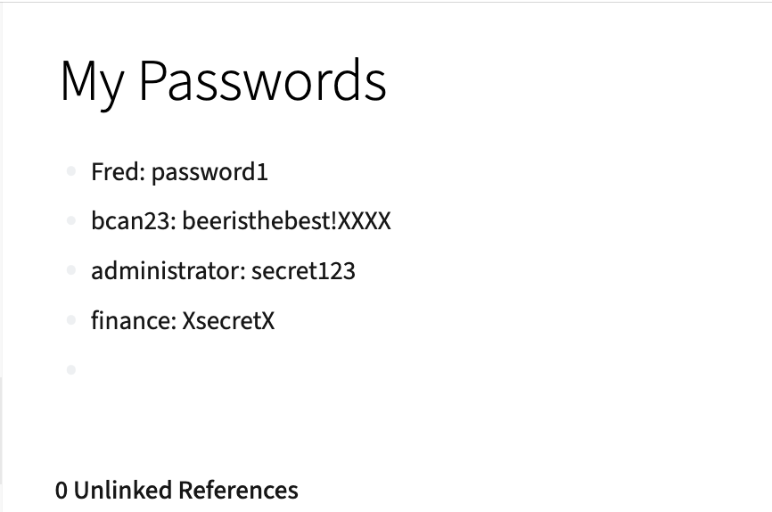
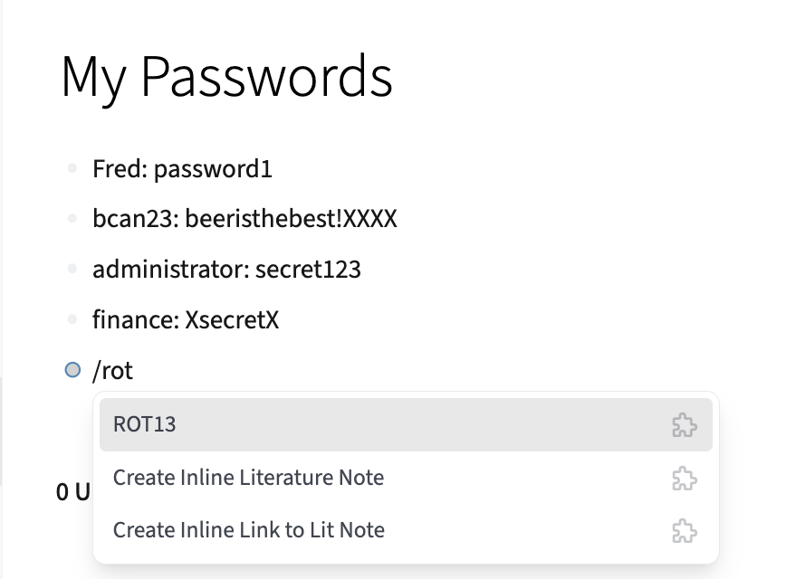
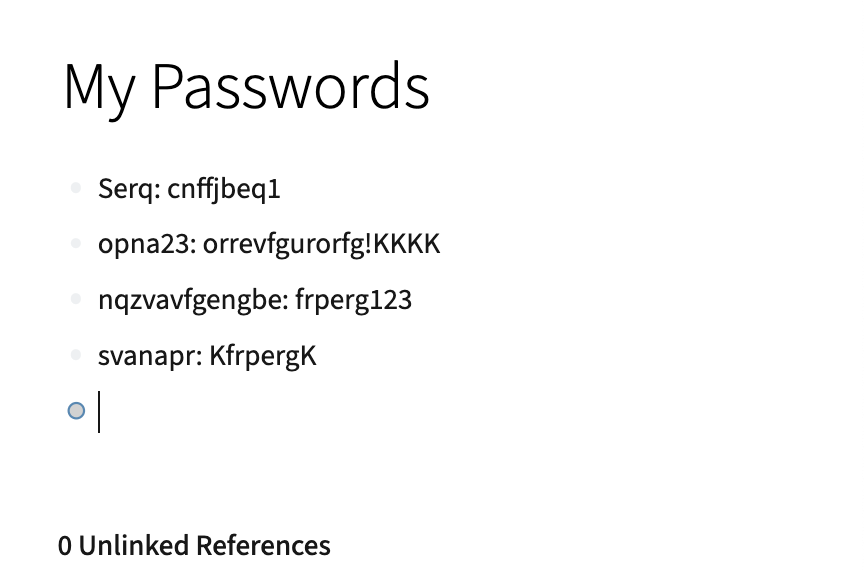

# ROT13
A logseq plugin implementing [ROT13](https://en.wikipedia.org/wiki/ROT13) by David Moss. 
Entering the slash command (/ROT13) causes every alphabetic character on the page to be rotated by 13 positions in the alphabet. 
Doing it again returns the text to normal.

This is a test of ROT13  <--->  Guvf vf n grfg bs EBG13

<h2>Why would I do that?</h2>
I store a page of useful passwords in logseq. I don't want to make it easy for someone to search my disk for a username and find the password. So I ROT13 the page with the usernames and passwords. The title stays the same so I can still find the page again in logseq. When I want to read it I ROT13 it again to view the original text. 
ROT13 also stops people shoulder surfing me for things I don't want them to see as I browse in logseq. 

<h2>How it works</h2>
Very easily! 
You just open any page you would like to obfuscate in logseq

and type /ROT13 after any block of text

Thats it!

To get the original text back, just type /ROT13 again in any text block.

Happy obfucating with ROT13 !
